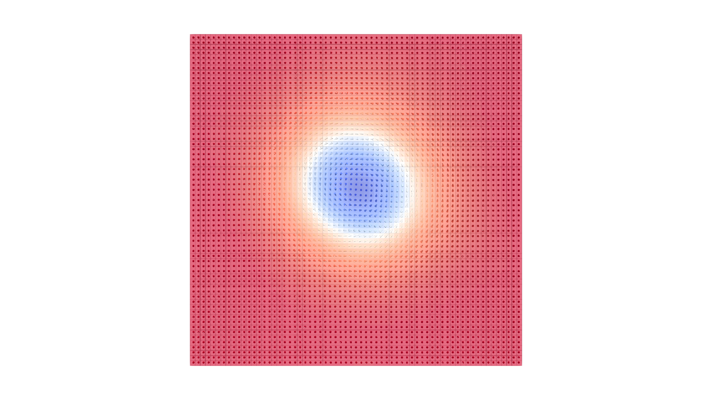

# ASD2VTK - Atomistic Spin Dynamics simulation data to VTK Converter



Author: Rajgowrav Cheenikundil, Orebro University.


ASD2VTK is a Python script that enables easy conversion of Atomistic Spin Dynamics (ASD) simulation data from UppASD simulations to Visualization Toolkit (VTK) files, for visualization in software such as ParaView. This tool simplifies the process of generating VTK files, allowing users to visualize atomistic simulation results efficiently.

## Features
- Converts UppASD simulation outputs (coord.*.out and restart.*.out) to VTK files.
- Automatically reads the data from the restart file and creates a VTU (UnstructuredGrid) file.


## Requirements
- Python 3.x
- VTK library (`pip install vtk --user`)
- ParaView installed for visualization 

## Usage
1. Ensure that the UppASD simulation outputs, "coord.*.out" and "restart.*.out," are in the same directory as the script.
2. Run the Python script "ASD2VTK.py" in the directory containing the aforementioned simulation outputs.                        
          (```python ASD2VTK.py```)
3. The script will generate a VTU file named "outfile_ASD.vtu" in the same directory.
4. Open the `outfile_ASD.vtu` with Paraview and click on "Apply"
5. In ParaView, chose `Cell_Magnetization` as the visualization field
6. If you want to plot the magnetization with arrows, chose the "Glyph" tool in Paraview, and chose `Cell_Magnetization` as the orientation array.

( The outputs written using version 1.0 of  ASD2VTK.py are tested and working/opening without errors on Paraview version 5.11.0 on Ubuntu  version 23  )

**Note:**
- Make sure that there is only one "coord.*.out" and one "restart.*.out" file in the running directory.
- The number of points in the VTU file will be 8 times the number of atoms, as 8 points are needed for each cube.

## Contributing
Contributions to improve ASD2VTK are welcome! Feel free to open issues, suggest enhancements, or submit pull requests. Let's collaborate and make this tool even better.

## License
ASD2VTK is released under the GNU Affero General Public License version 3.0 (GNU AGPLv3). Please see the `LICENSE` file for more details.

## Disclaimer
This software is provided as-is and comes with no warranty. 

---
